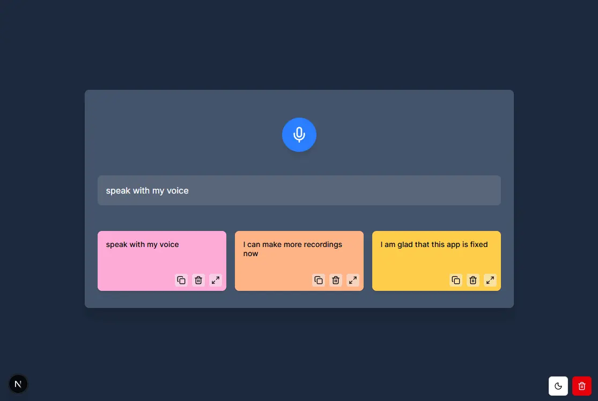

# Voice to Text Dictation App

A modern, responsive voice-to-text dictation application built with Next.js, React, and the Web Speech API.



[Vercel Live Link - https://voice-to-text-next.vercel.app/](https://voice-to-text-next.vercel.app/)

## Features

- **Voice Recognition**: Record and transcribe speech in real-time
- **Persistent Storage**: Automatically saves transcriptions to local storage
- **Beautiful UI**: Clean, responsive interface with dark/light mode support
- **Card System**: Organizes transcriptions into colorful, easy-to-manage cards
- **Animations**: Visual feedback with animated electron orbiting during recording
- **Copy & Share**: Copy transcriptions to clipboard or view in modal dialog
- **Silence Detection**: Automatically stops recording after periods of silence

## Technology Stack

- **Framework**: Next.js 14
- **Language**: TypeScript
- **Styling**: Tailwind CSS
- **UI Components**: Shadcn UI component library
- **Animations**: Framer Motion
- **Icons**: Lucide React
- **Speech Recognition**: Web Speech API
- **State Management**: React Hooks
- **Storage**: Browser localStorage

## Getting Started

### Prerequisites

- Node.js 18+ installed
- npm or yarn package manager

### Installation

1. Clone the repository

```bash
git clone https://github.com/chrislanejones/voice-to-text-next.git
cd voice-to-text-next
```

2. Install dependencies

```bash
npm install
# or
yarn
```

3. Start the development server

```bash
npm run dev
# or
yarn dev
```

4. Open [http://localhost:3000](http://localhost:3000) in your browser

## Usage

1. **Start Recording**: Click the microphone button to begin dictation
2. **Stop Recording**: Click the stop button to end recording
3. **View History**: Recorded transcriptions appear as cards below
4. **Manage Cards**:
   - Click the trash icon to delete individual cards
   - Click the maximize icon to view the full text in a modal
   - Click the copy icon to copy text to clipboard
5. **Clear All**: Use the delete button in the bottom-right corner to remove all cards
6. **Theme Toggle**: Switch between light and dark mode with the theme button

## Browser Compatibility

This application relies on the Web Speech API, which has varying levels of support across browsers:

- Chrome: Full support
- Edge: Full support
- Firefox: Partial support
- Safari: Partial support

For best results, use Chrome or Edge.

## Project Structure

```
/app
  /components
    /ui                   # Shadcn UI components
    CardSection.tsx       # Card grid for transcriptions
    DictationApp.tsx      # Main application component
    DictationButton.tsx   # Recording button with animations
    Modal.tsx             # Modal dialog component
    SpeechRecognitionService.tsx  # Speech recognition logic
  /lib
    utils.ts              # Utility functions
  page.tsx                # Main page component
  layout.tsx              # App layout with theme provider
```

## License

MIT License - see the LICENSE file for details.

## Contributing

Contributions are welcome! Please feel free to submit a Pull Request.

## Acknowledgments

- Speech recognition powered by the Web Speech API
- UI components from shadcn/ui
- Icons from Lucide React
- Animation library from Framer Motion
