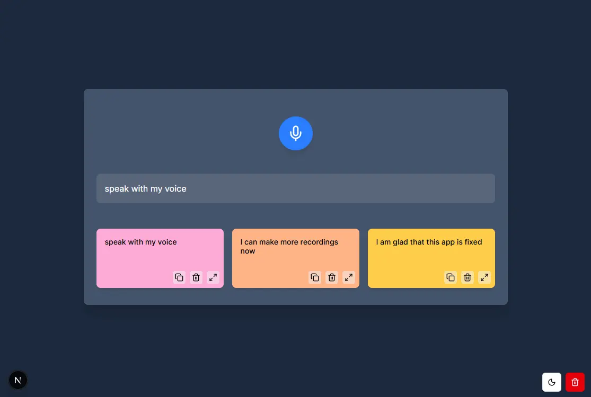

# Voice to Text

Talk, and your words show up on the page. Pin the ones you want to keep to a board of notes. The notes stay in your browser.

It runs on Next.js 16 with the Broadsheet design. AI tools (Whisper transcription, rewrites, translation, a natural voice, and questions about your notes) run through Replicate and sit behind a password.



_This screenshot shows the old design (dark theme, colored cards). The app now uses the light Broadsheet layout. A new screenshot is on the to-do list._

Live: [voice-to-text-next.vercel.app](https://voice-to-text-next.vercel.app/)

## How it works

1. Tap the mic and talk. Tap again to stop. Free dictation also stops on its own after 8 seconds of silence.
2. Your transcript shows up below the mic. With AI tools on, pick a version: Original, Cleaned up, Email, Bullets, Summary, or a translation.
3. Pin it to the board. Nothing is saved until you pin it, so Discard really does throw it away.
4. The board keeps your last 10 notes. Each one can be read aloud, copied, opened, or taken down. Clear board asks before it wipes everything.

## What needs the password

Anyone can use the page. The AI tools spend my Replicate credit, so they need the owner password. Turn "AI tools" on and a sign-in box pops up. A session lasts 30 days in that browser.

| Feature | No password | With password |
|---|---|---|
| Dictation | Browser speech engine (Chrome, Edge, Safari) | Whisper, in any browser |
| Upload an audio file | No | Yes |
| Speaker labels ("Speaker 1:") | No | Yes, with Whisper |
| Pin, copy, open, take down, Clear board | Yes | Yes |
| Read aloud | Browser voice | Replicate's natural voice (Kokoro) |
| Cleaned up, Email, Bullets, Summary, Translate | No | Yes |
| Ask your notes | No | Yes |

The AI switch only shows up when the server has both a Replicate token and a password set. Without them, the page is the free version and nothing else.

## Browsers

Free dictation uses the browser's Web Speech API. Chrome, Edge, and Safari have it. Firefox doesn't.

In Firefox the mic still works as a button. Tap it and a popup explains that Firefox has no speech engine, points you to Chrome, Edge, or Safari, and offers to sign in so you can use Whisper. Your board still works in Firefox either way.

Chrome sends browser dictation audio to Google's servers. That's how the Web Speech API works there, not something this app adds.

## Run it locally

You need Node 20.9 or newer and pnpm.

```bash
git clone https://github.com/chrislanejones/voice-to-text-next.git
cd voice-to-text-next
pnpm install
pnpm dev
```

Open [http://localhost:3000](http://localhost:3000). That gets you the free version.

### Turning on the AI tools

Make a `.env.local` file in the project root. It's git-ignored.

```bash
REPLICATE_API_TOKEN=r8_your_token_here
AI_PASSWORD=pick-a-long-one
```

Both have to be set or the AI tools stay hidden. Changing `AI_PASSWORD` signs out every browser.

These three are optional. Each one swaps a model without touching code. Use `owner/name` for the latest version or `owner/name:version` to pin one.

| Variable | Default | Used for |
|---|---|---|
| `REPLICATE_TEXT_MODEL` | `meta/meta-llama-3-70b-instruct` | Cleaned up, Email, Bullets, Summary, Translate, Ask your notes |
| `REPLICATE_TRANSCRIBE_MODEL` | `thomasmol/whisper-diarization` | Transcription and speaker labels |
| `REPLICATE_SPEECH_MODEL` | `jaaari/kokoro-82m` | Read aloud |

### Limits

- Audio tops out at 4.4 MB, under Vercel's 4.5 MB request limit. Recordings are 32 kbps Opus, so that's about 15 minutes, and the recorder stops itself at 15. Uploaded files are often bigger per minute, so they hit the cap sooner.
- Rewrites take up to 20,000 characters. The natural voice reads up to 5,000.
- Each AI request gives up after about 280 seconds.

### Other scripts

```bash
pnpm build   # production build
pnpm start   # serve the build
pnpm lint    # eslint
```

## Privacy

Your notes live in this browser's localStorage and nowhere else. There's no database and no account.

With AI tools on, the text you rewrite or ask about, the audio you record or upload, and the text you have read aloud all go to Replicate. Ask your notes sends every pinned note with the question.

## Decisions

The reasons behind the bigger choices are written up as ADRs. Full list: [docs/adr/INDEX.md](docs/adr/INDEX.md).

- [ADR-001](docs/adr/001-history-external-store.md): The old dictation history lived in a localStorage store read through `useSyncExternalStore`. Superseded by 004.
- [ADR-002](docs/adr/002-dictation-session-restarts.md): Each dictation restarts the browser recognizer behind the scenes, so long dictations don't cut off after a minute.
- [ADR-003](docs/adr/003-replicate-backend-routes.md): The AI tools run through Next.js route handlers that call Replicate with plain `fetch`. The token never reaches the browser.
- [ADR-004](docs/adr/004-broadsheet-portal-rebuild.md): The UI moved to the Broadsheet design, and notes became structured objects you pin on purpose.
- [ADR-005](docs/adr/005-ai-owner-password.md): The AI tools sit behind one owner password with a signed-cookie session.

002 through 005 are drafts. 001 is superseded.

## Known gaps

The full list is in [PARKING_LOT.md](PARKING_LOT.md). The ones that matter most:

- Wrong passwords are slowed down (800 ms each) but not rate-limited. A firewall rule on `/api/ai/login` should go in before the AI tools go public.
- The AI tools haven't been tested against live Replicate yet. The upload field name, the Whisper output shape, and the Kokoro output are written from the docs, not checked.
- The Whisper and Kokoro models aren't pinned to a version, so an upstream change can break them.
- No streaming. Rewrites and answers show up all at once.
- The screenshot above is out of date.
